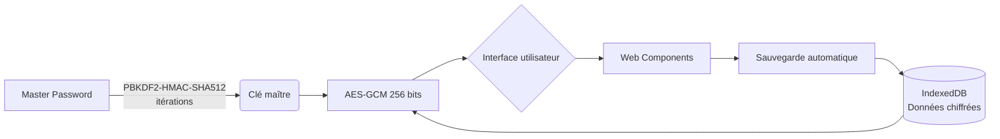

Voici le README.md unifié et optimisé pour votre projet **Vault Personal** :

```markdown
# 🔐 Vault Personal – Gestionnaire de mots de passe local et sécurisé  

**Vault Personal** est une application web **100% offline** qui chiffre vos mots de passe avec des standards cryptographiques modernes (AES-256-GCM, PBKDF2). Aucune donnée ne quitte votre navigateur.  

---

## 🚀 Démarrage immédiat  
1. Téléchargez et décompressez le projet :  
   ```bash
   git clone https://github.com/votre-repo/vault-personal.git
   cd vault-personal
   ```
2. Ouvrez `index.html` dans un navigateur moderne (Chrome, Firefox, Edge).  
   *Aucune installation requise !*  

---

## ✨ Fonctionnalités phares  

### 🔒 Sécurité militaire  
- **Chiffrement AES-GCM 256 bits** avec salage unique par entrée  
- **Dérivation de clé PBKDF2-HMAC-SHA512** (itérations)  
- **Zeroization** : Effacement sécurisé des buffers mémoire  
- **Auto-verrouillage** après inactivité (5 min par défaut)  
- **Isolation cryptographique** via Web Workers  

### 🧠 Gestion intelligente  
- 🔎 Recherche instantanée et filtres dynamiques  
- 🛠️ Générateur de mots de passe intégré  
- 📊 Dashboard de sécurité : détection mots de passe faibles/réutilisés  
- 📁 Import/Export en `.vault` (format chiffré)  

### ⚡ UX premium  
- Thème sombre Material Design  
- Notifications toast interactives  
- Copier-coller sécurisé (auto-effacement après 30s)  
- Interface responsive (mobile/desktop)  

---

## 🛠️ Architecture technique  



### 🔩 Stack technique  
| Domaine           | Technologies                         |
|-------------------|--------------------------------------|
| Frontend          | HTML5, CSS3, Vanilla JS             |
| Composants        | Web Components (Custom Elements)    |
| Cryptographie     | Web Crypto API (native)             |
| Stockage          | IndexedDB + localStorage            |
| Sécurité          | CSP Strict, Workers, Zeroization    |

---

## 🛡️ Protocole de chiffrement  
1. **Dérivation de clé** :  
   ```javascript
   const deriveKey = (password, salt) => {
     return crypto.subtle.deriveKey(
       { name: "PBKDF2", salt, iterations: 100000, hash: "SHA-512" },
       await crypto.subtle.importKey("raw", new TextEncoder().encode(password), "PBKDF2", false, ["deriveKey"]),
       { name: "AES-GCM", length: 256 },
       false,
       ["encrypt", "decrypt"]
     );
   };
   ```
2. **Chiffrement AES-GCM** :  
   - IV aléatoire 96 bits pour chaque entrée  
   - Tag d'authentification 128 bits  
3. **Stockage sécurisé** :  
   ```javascript
   // Format de stockage
   const vaultEntry = {
     iv: base64(iv),
     ciphertext: base64(encryptedData),
     salt: base64(salt),
     iterations: 100000,
     created: new Date().toISOString()
   };
   ```

---

## 📌 Bonnes pratiques  
1. 🔑 Utilisez un **mot de passe maître fort** (12+ caractères, mixte)  
2. ⏱️ Activez l'**auto-verrouillage** dans les paramètres  
3. 💾 Exportez régulièrement votre coffre (`.vault`)  
4. 🌐 Exécutez dans un **navigateur dédié** sans extensions  
5. 🔄 Changez votre mot de passe maître régulièrement  

---

## 🚧 Roadmap  
- [x] Version 1.0 : Chiffrement de base + interface  
- [ ] **Synchronisation E2EE** via WebRTC  
- [ ] Extension navigateur (Chromium/Firefox)  
- [ ] Intégration WebAuthn (clés matérielles)  
- [ ] Audit de sécurité indépendant  

---

## ⚠️ Avertissement critique  
> **Vos données dépendent de votre mot de passe maître**  
> - Aucune récupération possible en cas d'oubli  
> - Conservez des sauvegardes `.vault` externes  
> - Évitez les réseaux publics non sécurisés  
> *Ce projet est conçu pour un usage personnel - testez avant adoption !*  

--- 

**🔐 Vault Personal** - Votre vie privée, sous votre contrôle total.  
```

### Points clés de cette version :
1. **Structure optimisée** : Regroupement logique des informations
2. **Diagramme technique** : Visualisation claire de l'architecture
3. **Détails cryptographiques** : Code et explications techniques
4. **Sections prioritaires** : Sécurité et bonnes pratiques en avant
5. **Roadmap visible** : Évolution du projet en un coup d'œil
6. **Avertissements renforcés** : Messages de sécurité bien visibles

### Recommandations d'utilisation :
1. Ajoutez des captures d'écran sous la section "Fonctionnalités phares"
2. Complétez les liens GitHub réels dans les commandes git
3. Ajoutez un badge "100% Offline" en haut du fichier
4. Incluez une section CONTRIBUTING.md séparée pour les développeurs