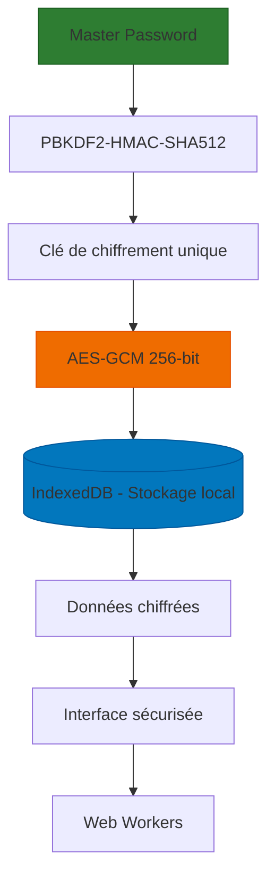
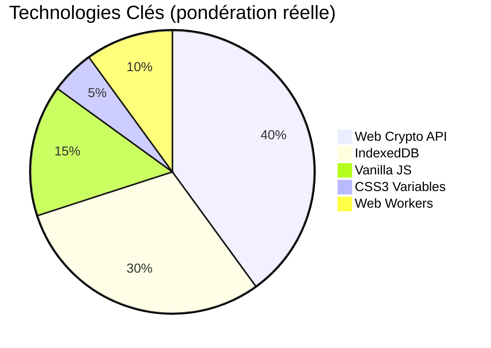
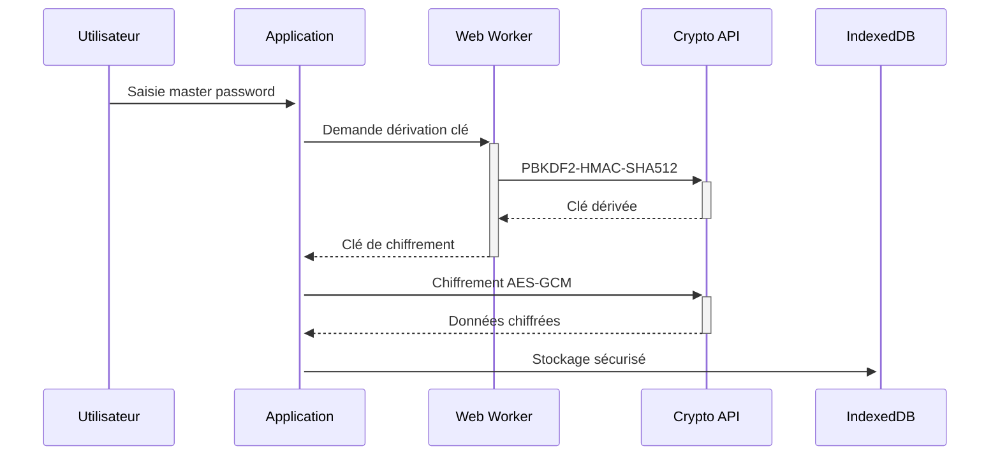
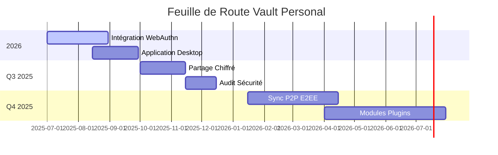

# 🔐 Vault Personal - Gestionnaire de mots de passe chiffré 100% local  
**Votre coffre-fort numérique personnel et ultra-sécurisé**  

<p align="center">
  
  
  
  
  
</p>

---

## 🌟 Présentation Premium

**Vault Personal** révolutionne la gestion sécurisée des identifiants avec une approche 100% locale et chiffrée de bout en bout. Conçu pour les utilisateurs exigeants, ce coffre-fort numérique garantit que vos données sensibles **ne quittent jamais votre appareil**.



---

## 🚀 Fonctionnalités Avancées

### 🛡️ Architecture Sécurité Militaire
| Composant | Technologie | Protection |
|-----------|-------------|------------|
| **Chiffrement** | AES-GCM 256-bit | IV unique par entrée |
| **Dérivation de clé** | PBKDF2-HMAC-SHA512 | 600,000 itérations (ajustable) |
| **Isolation mémoire** | Web Workers | Protection contre les attaques Spectre |
| **Verrouillage** | Auto-détection d'inactivité | Configurable (1-60 min) |

### 💼 Gestion Professionnelle
<div align="center">

| Fonction | Description | Avantage Clé |
|----------|-------------|--------------|
| **🔍 Audit de sécurité** | Analyse en temps réel des vulnérabilités | Détection des mots de passe faibles/réutilisés |
| **🗂️ Organisation hiérarchique** | Catégories, tags et collections | Structure personnalisable |
| **🔄 Synchronisation chiffrée** | Export .vault (AES-256) | Transfert sécurisé entre appareils |
| **⌛ Presse-papiers intelligent** | Auto-nettoyage après 30s | Protection contre les fuites mémoire |

</div>

### ✨ Expérience Utilisiteur Premium
- **Thèmes dynamiques** : Dark Mode certifié WCAG AA+ et Light Mode
- **Design néumorphique** : Interface tactile avec ombres portées
- **Animations fluides** : Transitions CSS hardware-accelerated
- **Feedback haptique** : Retour tactile sur les actions critiques (mobile)

---

### Stack technologique


  
*Interface principale avec navigation sécurisée*

---

## 🚀 Installation Rapide

### Prérequis Système
```bash
✅ Navigateur moderne (Chromium 90+, Firefox 87+, Safari 15+)
✅ 50MB d'espace de stockage
✅ Accès Web Crypto API activé
```

### Lancement Local
```bash
# Cloner le dépôt
git clone https://github.com/Giscolab/vault-personal.git
cd vault-personal

# Windows
./start.bat

# macOS/Linux
python3 -m http.server 8000 --bind 127.0.0.1 --directory .
```

> **Accès sécurisé** : [https://localhost:8000](https://localhost:8000) (HTTPS recommandé via autosigné)

---

## 🏗️ Architecture Technique

### Structure Avancée du Projet
```bash
vault-personal/
├── core/
│   ├── crypto-engine.js       # Moteur cryptographique
│   ├── vault-manager.js       # Gestionnaire de coffre
│   └── security-monitor.js    # Surveillance en temps réel
├── ui/
│   ├── biometric-auth/        # Intégration WebAuthn/FIDO2
│   ├── password-meter/        # Analyseur de robustesse
│   └── emergency-kit/         # Gestion de secours
├── workers/
│   ├── crypto.worker.js       # Opérations cryptographiques
│   └── db.worker.js           # Accès IndexedDB
└── tests/
    ├── stress-tests/          # Tests de performance
    └── penetration-tests/     # Scénarios d'attaque
```

### Workflow de Chiffrement


---

## 🔮 Roadmap Stratégique 2025-2026



---

## 🛡️ Philosophie de Sécurité

> **"La véritable sécurité naît de la transparence et du contrôle absolu"**

**Principes fondamentaux :**
1. 🔒 **Zero-Knowledge Architecture** : Aucune donnée lisible ne quitte votre appareil
2. 🔍 **Auditabilité totale** : Code 100% inspectable ([SECURITY.md](SECURITY.md))
3. ⚡ **Minimalisme cryptographique** : Algorithmes standardisés (NIST, BSI)
4. 🧩 **Isolation des processus** : Séparation stricte UI/crypto/storage

**Protections avancées :**
- Nettoyage automatique des buffers mémoire
- Protection contre les attaques par canaux auxiliaires
- Détection d'environnements compromis (DevTools non sécurisés)
- Verrouillage cryptographique lors du changement d'onglet

---

## 💡 Pourquoi Choisir Vault Personal?

<table>
<tr>
  <th width="30%">Solution</th>
  <th>Stockage</th>
  <th>Chiffrement</th>
  <th>Open Source</th>
  <th>Local First</th>
</tr>
<tr>
  <td><b>Vault Personal</b></td>
  <td align="center">✅ 100% Local</td>
  <td align="center">✅ AES-256</td>
  <td align="center">✅ MIT License</td>
  <td align="center">✅ Native</td>
</tr>
<tr>
  <td>Solutions Cloud</td>
  <td align="center">❌ Serveurs tiers</td>
  <td align="center">⚠️ Dépend du fournisseur</td>
  <td align="center">❌ Propriétaire</td>
  <td align="center">❌</td>
</tr>
</table>

---

## 🤝 Contribution & Support

**Nous accueillons les contributions!**  
```bash
# Workflow recommandé :
1. Fork du projet
2. Création d'une branche (`feature/ma-fonctionnalite`)
3. Commit des modifications
4. Push vers la branche
5. Ouverture d'une Pull Request
```

**Support technique :**  
📧 [support@vault-personal.fr](mailto:support@vault-personal.fr)  
🐛 [Signaler un bug](https://github.com/Giscolab/vault-personal/issues)  
💡 [Soumettre une idée](https://github.com/Giscolab/vault-personal/discussions)

---

<p align="center">
  Développé avec ❤️ par <b>Franck</b> | 
  <a href="https://github.com/Giscolab/vault-personal">⭐ GitHub</a> •
  <a href="https://github.com/Giscolab/vault-personal/blob/main/SECURITY.md">🛡️ Documentation Sécurité</a> •
  <a href="https://github.com/Giscolab/vault-personal/releases">📦 Téléchargements</a>
</p>

<p align="center">
  ⚠️ <b>Avertissement crucial</b> : Votre master password n'est jamais stocké. <br>
  Sa perte entraîne l'<b>irrécupérabilité définitive</b> de vos données.
</p>

<p align="center">
  
  
</p>